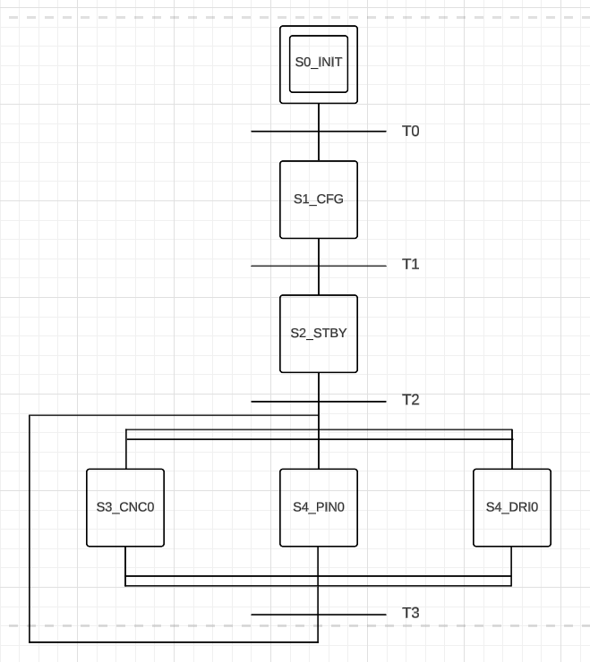
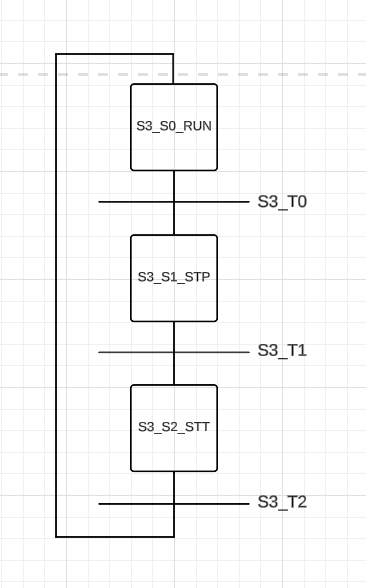

# Estructura de la lógica de programa de PLC

De acuerdo con las especificaciones del proyecto, el código en ladder fue desarrollado, planteando un diagrama de GRAFCET, el cual se puede observar a continuación.

Las etapas S3, S4 y S5 se ejecutan en paralelo, y cada una se corresponde con un subsistema de la planta automatizada. El estado S3_CNC0 corresponde a la cinta transportadora a la salida de la fresadora CNC, el estado S4_PIN0 (Part interchange) corresponde al conjunto mordaza + cinta transportadora que permite ingresar o retirar piezas a la celda de taladrado, y el estado S5_DRI0 (DRILL) corresponde al conjunto de cinta transportadora + mordaza neumática + mecanismo de taladrado, que se encarga de taladrar las piezas. Cada uno de estos estados se corresponde con un GRAFCET que describe la operación normal de cada subsistema, sin embargo se separan en GRAFCETS separados para facilitar la programación en ladder en subrutinas separadas.

## GRAFCET Global

- S0_INIT: Inicialización de las variables de control del programa y posibilidad de controlar todos los actuadores de forma manual desde SCADA, asi como monitorear las variables, con el fin de poder comprobar fácilmente el funcionamiento apropiado de todos los elementos del proceso.
- T0: Accionamiento del botón "START".
- S1_CFG: Homing de los actuadores.
- T1: Detección de que todos los actuadores hallan llegado a su posición de home.
- S2_STBY: Modo de espera y pausa, donde todos los actuadores se encuentran detenidos
- T2: Accionamiento del botón "START".
- S3_CNC0: Funcionamiento normal del subsistema de la cinta transportadora de la fresadora CNC.
- S4_PIN0: Funcionamiento normal del subsistema de intercambiador de piezas.
- S5_DRI0: Funcionamiento normal del subsistema de taladrado.
- T3: Accionamiento del botón "STOP".

## GRAFCET S3_CNC0

- S3_S0_RUN: Estado permanente de funcionamiento de la cinta transportadora
- S3_T0: Detección de pieza mediante sensor
- S3_S1_STP: Parada de la cinta transportadora y señal de notificación al robot indicando que hay una nueva corte disponible.
- S3_T1: Señal booleana desde Robot, indicando que la pieza ha sido retirada
- S3_S2_STT: Arranque de la cinta transportadora y funcionamiento durante 2 segundos con el fin de garantizar la evacuación de los residuos de corte.
- S3_T2: Transcurso de 2 segundos.

## GRAFCET S4_PIN0

- S4_S0_RUN: Estado permanente de funcionamiento de la cinta transportadora.
- S4_T0: Detección de pieza mediante sensor.
- S4_S1_STP: Parada de la cinta transportadora y señal de notificación al robot indicando que hay una plantilla disponible en la zona de intercambio.
- S4_T1: Espera de 1 segundo para garantizar que la pieza este detenida.
- S4_S2_CLE: Cierre de la mordaza neumática.
- S4_T2: Detección de que la mordaza se ha cerrado y señal desde el robot indicando que la pieza ha sido retirada y/o se ha colocado una nueva pieza sobre la plantilla.
- S4_S3_OPN: Apertura de la mordaza neumática.
- S4_T3: Detección de que la mordaza se ha abierto.
- S4_S4_STT: Arranque de la cinta transportadora y funcionamiento durante 2 segundos con el fin de garantizar la evacuación de la plantilla de la zona correspondiente a la mordaza.
- S4_T4: Transcurso de 2 segundos.

## GRAFCET S5_DRI0

En este bloque, se tiene en cuenta que existe una disposición inicial de las plantillas sobre la planta, de tal forma que es necesario dejar pasar 2 plantillas antes de que el proceso de taladrado pueda comenzar, dado que estas primeras piezas no han pasado por el intercambiador de piezas, y por lo tanto no cuentan con pieza que requieran taladrado.

- S5_S0_BYS: La cinta transportadora del subsistema de taladrado funciona de forma simultanea a la cinta transportadora del subsistema de intercambiador de piezas, de tal forma que si la segunda se detiene, la primera también lo hará e igualmente arrancara si la segunda lo hace.
- S5_T0: Detección de pieza mediante sensor.
- S5_S1_WAT: Espera hasta que la pieza detectada haya pasado sin ejecutar ninguna operación, e incremento del contador de piezas que se deben dejar de pasar al principio del proceso.
- S5_T1: No se detecta una pieza en la zona de taladrado y el contador aun no llega a dos.
- S5_T2: No se detecta una pieza en la zona de taladrado y el contador llega a dos.
- S5_S2_RUN: Estado permanente de funcionamiento de la cinta transportadora.
- S5_T3: Detección de pieza mediante sensor.
- S5_S3_STP: Parada de la cinta transportadora.
- S5_T4: Espera de 1 segundo para garantizar que la pieza este detenida.
- S5_S4_CLE: Cierre de la mordaza neumática.
- S5_T5: Detección de que la mordaza se ha cerrado.
- S5_S5_DRI: Secuencia de taladrado sobre las piezas de la plantilla.
- S5_T6: Finalización del taladrado.
- S5_S6_OPN: Apertura de la mordaza neumática.
- S5_T7: Detección de que la mordaza se ha abierto.
- S5_S7_STT: Arranque de la cinta transportadora y funcionamiento durante 2 segundos con el fin de garantizar la evacuación de la plantilla de la zona correspondiente a la mordaza.
- S5_T8: Transcurso de 2 segundos.