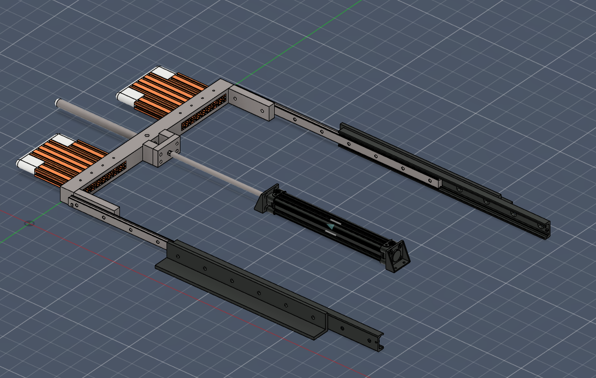
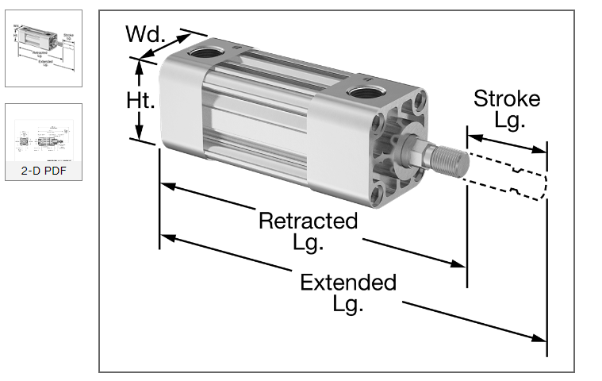
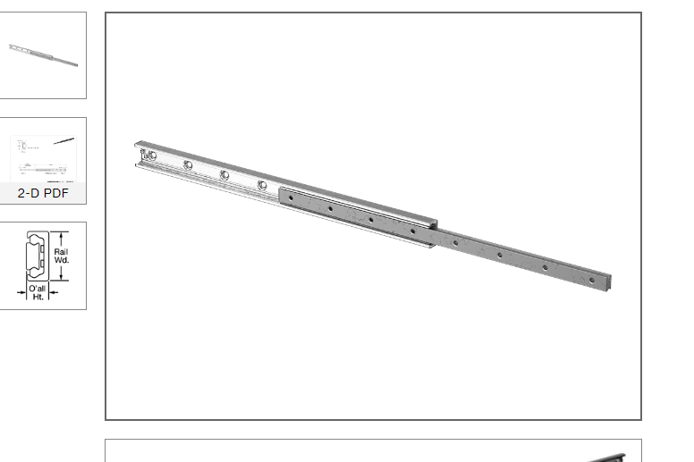
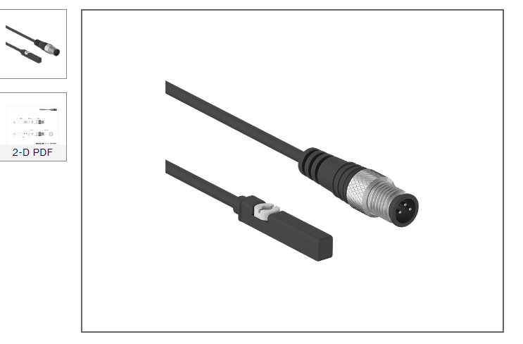

# Mordaza Neumática

La mordaza neumática se trata de un mecanismo que permite el movimiento en un eje controlado por un cilindro neumático de doble efecto y soportado por dos guías lineales. Se encarga de la fijación de las plantillas en las estaciones de taladrado e intercambio de piezas, con el fin de garantizar un posicionamiento adecuado tanto en el taladrado, como en el pick an place de las piezas por parte del robot, eliminando la necesidad de un sistema de vision de maquina para el posicionamiento de las piezas.

El sistema fue diseñado teniendo en cuenta su fácil manufactura, por lo cual solo requiere la fabricación de soportes en acero conformado en caliente mediante soldadura, los cuales se representan en colo negro en la imagen presentada anteriormente (sin incluir la parte fija del cilindro neumático), el corte de 6 platinas de aluminio 6061 de 40mm de de espesor, el corte de una barilla de acero de 8mm de diámetro, la impresión 3D en un material de baja fricción como el nylon, de las piezas representadas en color blanco, y el corte de extrusiones de aluminio 8020 y 4020, en las piezas representadas de color naranja.

El cilindro neumático junto con sus sensores de final de carrera, y las guías que soportan la mordaza, fueron seleccionadas del proveedor de partes McMASTER-CARR, teniendo en cuenta que se requiere un movimiento mayor a los 250mm, que es el tamaño de los elementos que ingresan dentro de la plantilla. Las referencias de partes seleccionadas son las siguientes:
- [Enclosed-Body NFPA Tie Rod Air Cylinder - Cushioned, Double Acting, 32mm Bore, 275mm Stroke Length](https://www.mcmaster.com/60405K127/)

- 2 x [Telescoping Slide - C Rail Profile, 43 mm Wide x 610 mm Long Rail](https://www.mcmaster.com/8379K12/)

- 2x [10-30V DC NPN Sensor for 2-1/2" Bores Enclosed-Body NFPA Tie Rod Air Cylinder](https://www.mcmaster.com/6402T924/)

El cilindro neumático fue seleccionado en base al alcance del movimiento requerido, a partir de allí solo se requirió verificar que la presión maxima que puede entregar el cilindro, fuese mayor a la presión maxima requerida, debida a la fuerza del peso máximo de la carga desplazada, que es de alrededor de 100N, (el peso de los elementos fijos al vástago del cilindro).

Teniendo en cuenta que el diámetro del embolo es de 32mm, y que la presión maxima del cilindro es de 100 psi (0.69 MPa) se tiene que la fuerza maxima que puede entregar el cilindro es de:

$F = 0.69 MPa \times \pi \times 16mm^2 = 554.9 \N$

De lo anterior se concluye que el cilindro cuenta con la fuerza suficiente para mover la carga de 100N, ademas de tener un margen de seguridad aceptable.

Los tornillos requeridos para la construcción de una mordaza, son los siguiente:

- 12x M8  x 15mm cabeza plana
- 4x  M8  x 80mm
- 12x M6  x 30mm cabeza plana
- 4x  M12 x 80mm
- 1x  M12 x 40mm
- 17x M5  x 40mm

El Diseño CAD del mecanismo se encuentra disponible en este [enlace](./CAD/MordazaNeumatica%20v28.f3d).
