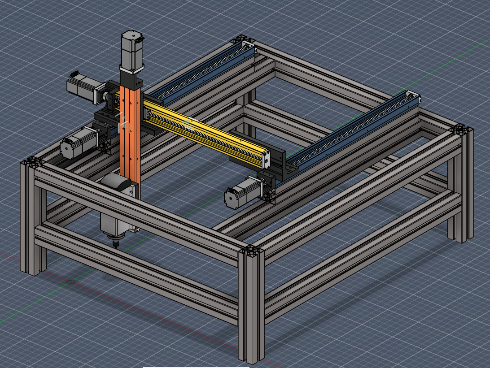
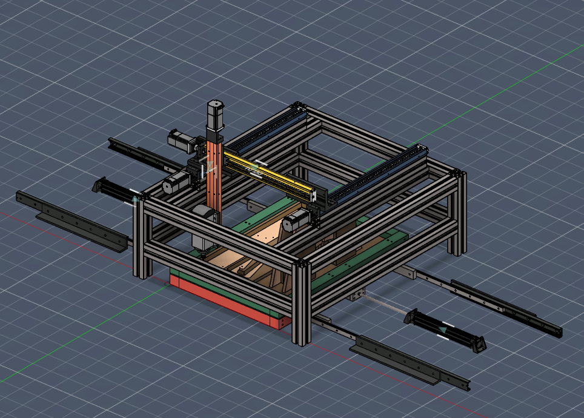

# Mecanismo de Taladrado

Se trata de un servomecanismo de 3 ejes tipo gantry, que permite taladrar las piezas mediante una broca. Su armazón esta construido mediante extrusiones de aluminio 6060, ángulos de sujeción y tornillos M12 x 60mm.

Esta pensado para ser utilizado junto a un par de mecanismos de mordazas neumáticas las cuales aseguran la posición de las piezas que requieren se taladradas, en un conjunto como el que se presenta en la siguiente imagen.

El Eje Y en color azul, es doble, tiene un rango de de 600mm, y es sobre el cual reposa todo el gantry. El eje X se muestra en color amarillo, tiene un rango de 500mm pero se reduce a 450mm debido a los elementos del ensamble. El eje z en color naranja tiene un rango de 400mm y carga consigo un motor con husillo que permite el movimiento de la broca. Cada eje se trata de un mecanismo de tornillo de avance que se adquiere ya ensamblado, y que se controla mediante motores de geometría NEMA 23. Los ejes X y Y se encuentran conectados mediante piezas de aluminio disponibles comercialmente, mientras que la union entre el eje X y el eje Z, asi como la union entre el eje Z y el motor de taladrado, son piezas personalizadas que pueden ser manufacturadas en un aluminio convencional 6061, mediante una fresadora vertical.

## Componentes

- Eje y: 2x [Motor-Mount Positioning Slide for NEMA 23 Motor Frame Size, 600 mm Stroke Length](https://www.mcmaster.com/6734K818)
- Eje X: [Motor-Mount Positioning Slide for NEMA 23 Motor Frame Size, 500 mm Stroke Length](https://www.mcmaster.com/6734K817)
- Eje Z: [Motor-Mount Positioning Slide for NEMA 23 Motor Frame Size, 400 mm Stroke Length](https://www.mcmaster.com/6734K816)
- Conexión entre Eje X y eje Y: 2x [Side Orientation Two-Axis Mounting Plate for Motor-Mount Positioning Slide](https://www.mcmaster.com/6734K821)
- Motor de taladrado: [1.5KW Air Cooled Spindle Square CNC Spindle Motor ER11/ER16](https://www.zhonghuajiangspindle.com/1.5kw-cnc-square-air-cooled-spindle-motor.html)
- Variador de frecuencia para el motor de taladrado: [CIMR-PU2A0018FAA YASKAWA](https://co.wiautomation.com/yaskawa/variadores-motores-proteccion-de-circuitos/CIMRPU2A0018FAA)
- 16x Tornillos M4 x 0.7mm para el fijado entre ejes
- 8x Tornillos M8 x 30mm para el fijado del motor de taladrado.
- 36x [T-Slotted Framing Silver Corner Bracket for 60mm High Rail, 1-1/8" Long](https://www.mcmaster.com/5537T941)
- 144x Tornillos M6 x 20mm para el fijado del armazón de aluminio mediante esquineros
- 10.5 metros de extrusion de aluminio 6060: 2x [T-Slotted Framing Quad Rail, Silver, 60 mm High x 60 mm Wide, Hollow](https://www.mcmaster.com/5537T99-5537T806/)

Para mas detalle sobre la selección de motores y sus respectivos drivers consulte este [documento](./Drivers%20y%20Motores%20(Motion%20Control).md)

El modelo CAD del mecanismo esta disponible en el [archivo](./CAD/MecanismoTaladrado%20v33.f3z)