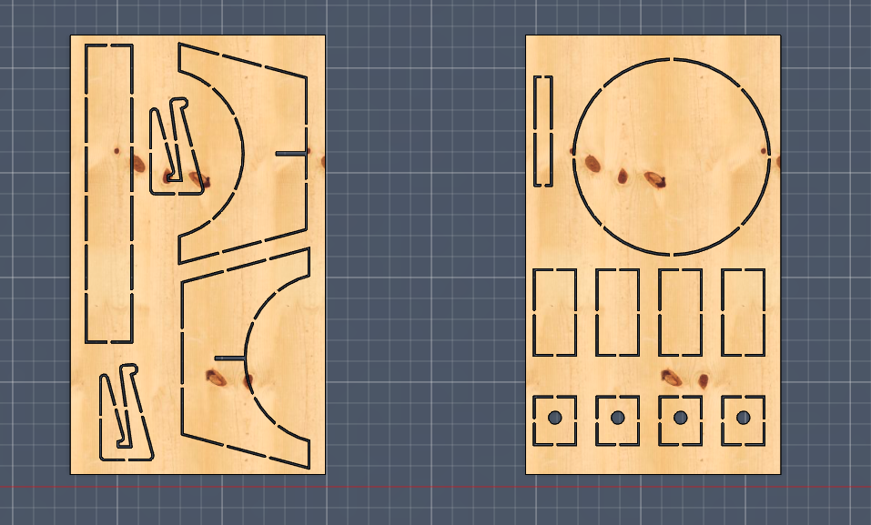
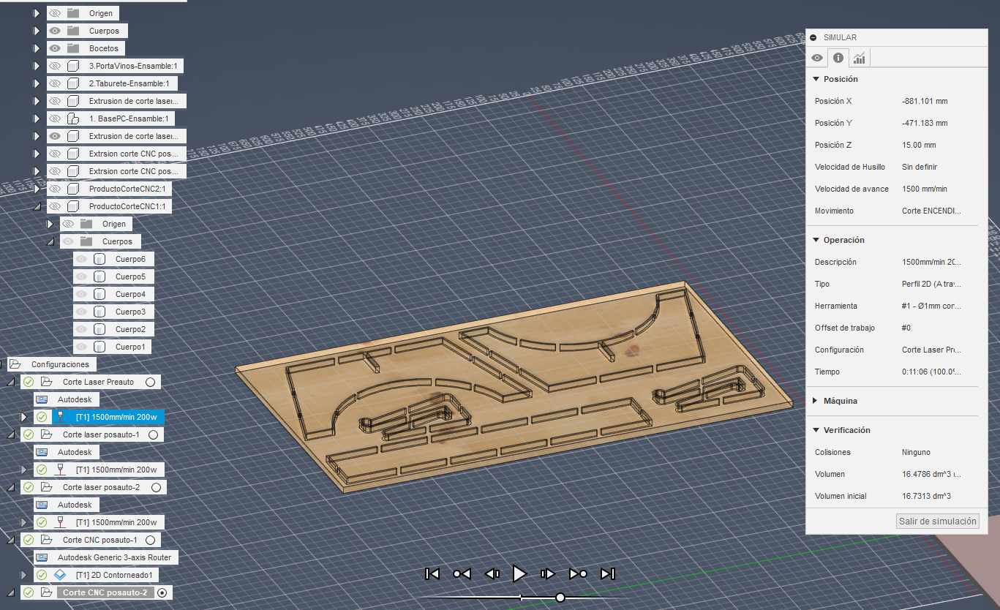
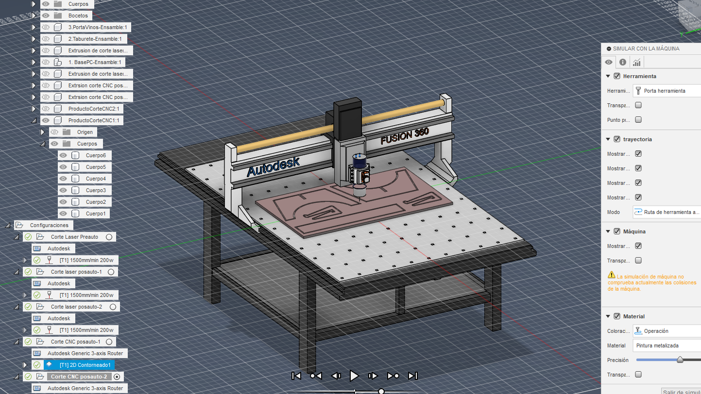

# Planos de Corte

## Corte laser

Teniendo en cuenta que las laminas de MDF que ingresan a la fresadora CNC deben tener un ancho exacto de 24 pulgadas (609.60mm) y ademas deben contener las piezas cortadas mediante laser sin que que se desprendan completamente de la lamina, se debe modificar el plano de corte laser. A continuación se muestra una imagen donde se muestran las piezas resultantes de dicho corte, de tal forma que todas las piezas se encuentran separadas en dos tableros de 609.80mm x 1050mm.

Como se muestra en la imagen, las piezas se encuentran unidas al tablero mediante pequeñas conexiones, de tal forma que en la mayoría del proceso de fresado CNC, solo se realice una operación de acabado de bordes, y no un desbaste completo de la pieza.

Mediante Fusion 360 se simulan las operaciones de corte, con una velocidad de corte de 1500mm/min, y una potencia de 200w (Ambos valores sacados de esta [referencia](https://artizono.com/co2-laser-cutting-thickness-speed-chart/)).

Se obtienen un tiempo de corte de 11 minutos, 6 segundos para la primera lamina, y 11 minutos, 50 segundos para la segunda lamina.

# Corte CNC

El corte ejecutado por la fresadora CNC se trata de un contoneado de acabado de bordes, ademas del desbaste de los conectores de la pieza con el taladro, repasando el borde de cada pieza en 2mm-3mm en función de su tamaño. La referencia de fresa seleccionada es la [Router Bit for Wood, Particleboard, Plywood
Uncoated High-Speed Steel, 3/16" Cutting Diameter, 5/8" Length of Cut](https://www.mcmaster.com/2891A11) de la web de McMASTER-CARR.

Se calcula una velocidad de corte $V_c = 270 \frac{m}{min}$,  con un avance de $V_f = 5760 \frac{mm}{min}$ a 18000 RPM, para metros que se utilizan para simular el corte y obtener los tiempos de corte.

- Tiempo de corte tablero 1: 1 minuto 42 segundos
- Tiempo de corte tablero 2: 1 minuto 53 segundos