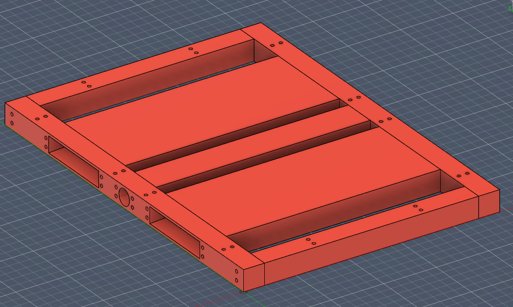
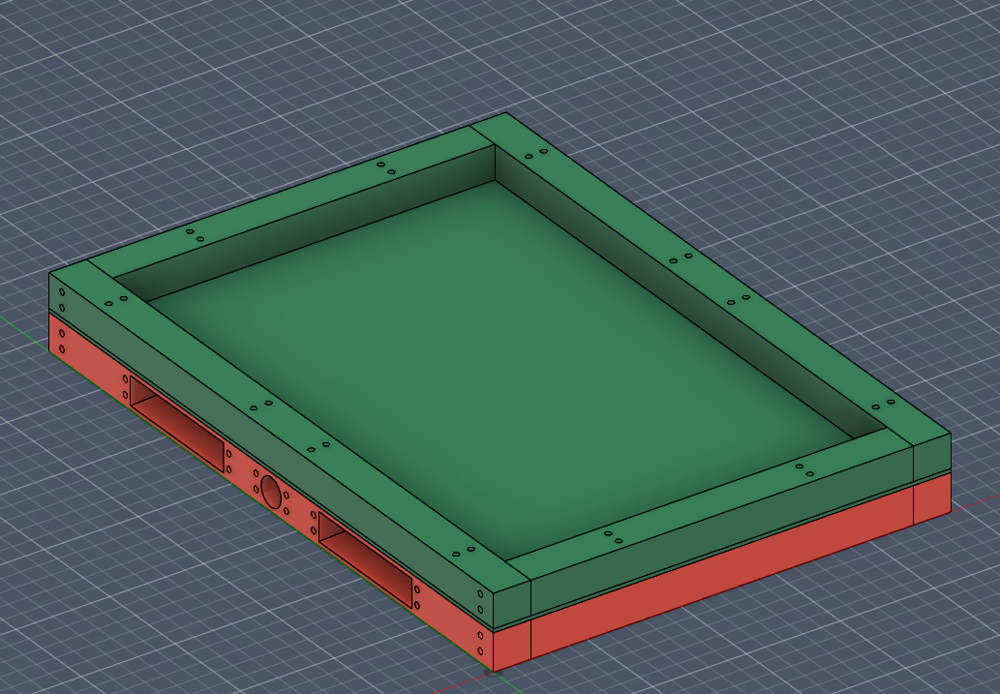
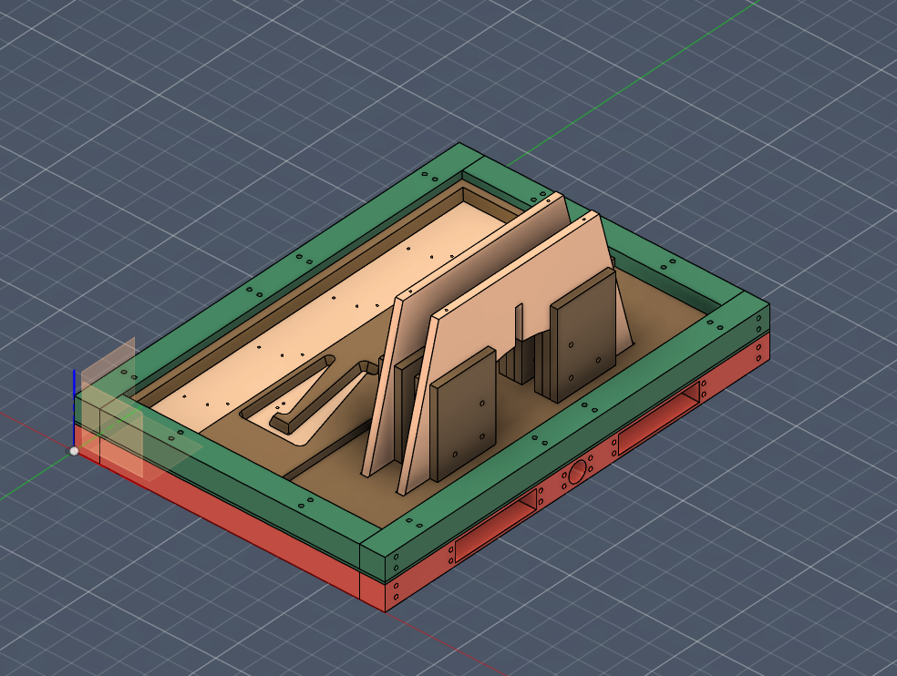
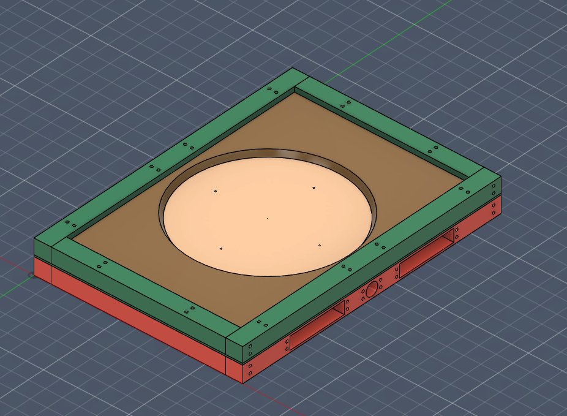
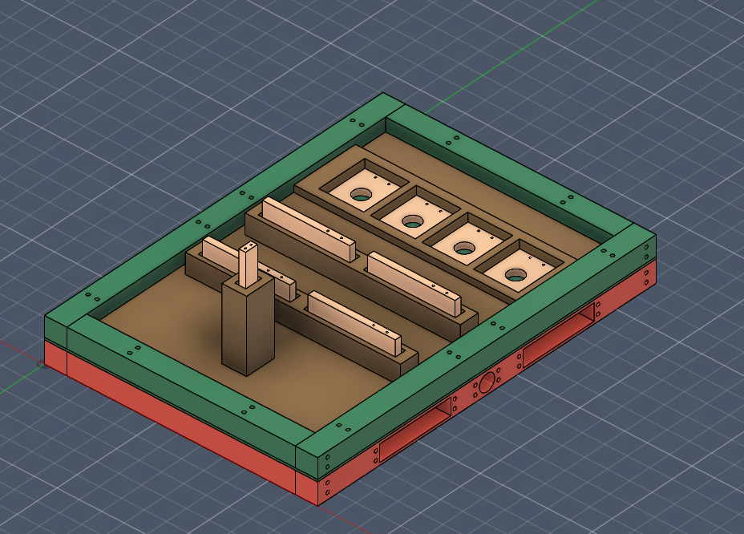
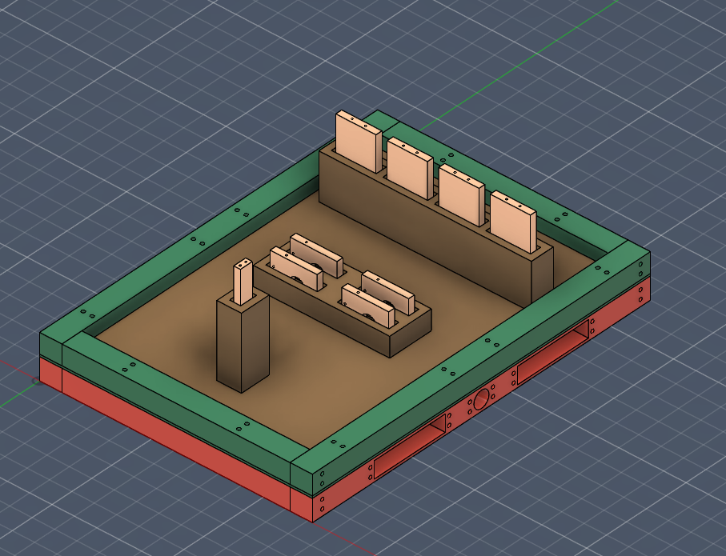

# Plantillas de sujeción de piezas

Las plantillas se proponen como un ensamble de platinas de aluminio de 50mm de espesor, con perforaciones de 8mm de diámetro, para permitir el paso de tornillos M8 de 100 mm de largo, de tal forma que el armazón completo se puede ensamblar usando 96 de estos tornillos. En las dos imágenes que se muestran a continuación se observan las dos partes principales del armazón, donde la parte roja sirve como sostén para toda la plantilla, y ademas cuenta con agujeros diseñados específicamente para el autocentrado de la plantilla con la mordaza neumática, y la parte verde es la que sostiene la geometría de la plantilla donde se alojan las piezas. Todas las platinas fueron diseñadas teniendo en cuenta que se puedan manufacturar en una fresadora vertical convencional de ejes y asi facilitar su producción y remplazo en el mercado local.

La pieza ensamblada tiene un tamaño total de 850mm x 24 pulgadas (609.6mm) acorde con el ancho de la cinta transportadora.

Por otro lado se diseñaron 4 geometrías en madera de MDF de 30mm, las cuales pueden ser ensambladas mediante el corte de laminas de 15mm, de tal forma que no se requieran capacidades de manufactura adicionales a las que ya cuenta la planta previo a la implementación de las celdas de manufactura automatizada.

A continuación se presentan las 4 geometrías propuestas, junto con las piezas de corte, con el fin de representar la distribución de las piezas durante el proceso de producción.

La plantilla 4 aloja las mismas piezas que la plantilla 3 pero en una orientación diferente, de tal forma que ambas plantillas permiten el taladrado de agujeros en 2 planos diferentes para cada pieza.

El modelo CAD de estas plantillas esta disponible en este enlace , siendo desarrollado mediante el software Fusion360.

El ensamble del armazón (pieza roja y verde) fabricado en aluminio 6061, tiene una masa de alrededor de 70kg, y junto a la geometría de la plantilla y las piezas alojadas, se estima un peso máximo de alrededor de 90Kg.
