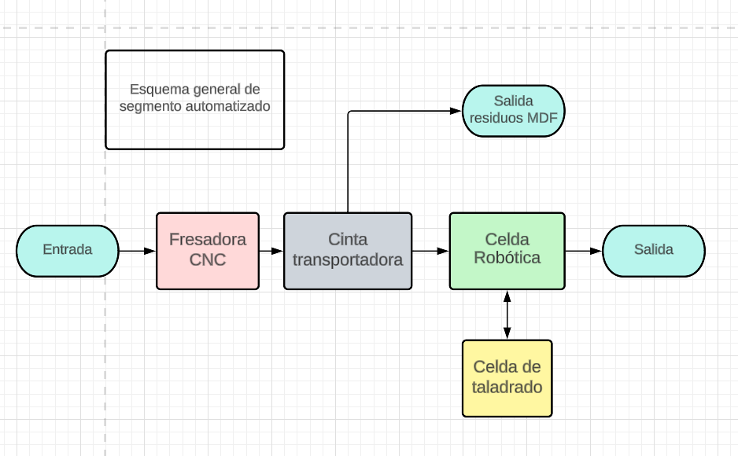
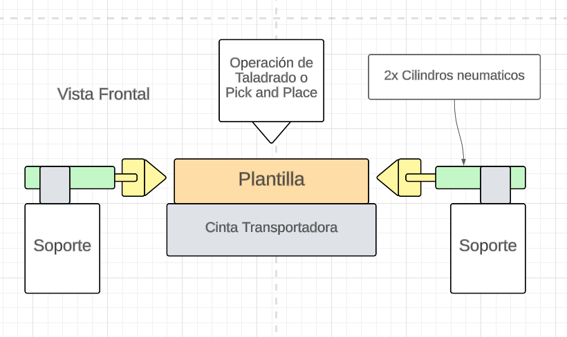

# Propuesta de planta automatizada

Para la propuesta de proyecto, se propone la automatización de los procesos que implican un mayor riesgo para los trabajadores, y al mismo tiempo son los mas críticos en cuanto a la repetibilidad, velocidad, y calidad del producto final, es decir los procesos de corte, específicamente el acabado de bordes, y el taladrado, de tal forma que el proceso de ensamblado, empaquetado y posteriores, seguirían teniendo la intervención humana.

En la siguiente imagen se muestra un esquema general de la propuesta, en el lado izquierdo se encuentra la entrada de laminas de MDf precortadas mediante las maquinas corte laser que ya cuenta la manufactura no automatizada. Las laminas ingresan a una maquina CNC que se encarga de terminar el corte y acabar los bordes, de tal forma que la fresa tiene un menor desgaste y se aprovecha la maquinaria de corte laser presente en el proceso manufacturero previo a la automatización.

Las laminas salen de la fresadora CNC por medio de una cinta transportadora, donde se evacuan los residuos del corte, y un robot antropomórfico recoge las piezas resultantes, y las ingresa a un celda de taladrado. De igual forma este mismo robot se encarga de recoger las piezas terminadas del taladrado y las ingresa en un contenedor de salida, que un operario puede retirar cada vez que se requieran mas piezas para el siguiente proceso.

En la siguiente imagen se presenta un esquema de vista superior de la celda de taladrado. esta consta de dos cintas transportadoras que forman un ciclo, de tal forma que el robot antropomórfico ingresa o retira las piezas en el modulo de la parte superior, y el taladrado se ejecuta en el modulo de la parte inferior. Las piezas transitan a lo largo de la cinta transportadora, a traves de un plantilla que asegura las piezas, de tal forma que cuando lleguen a cualquiera de los dos módulos, el posicionamiento de las piezas sea el mismo, y se pueda realizar el pick and place del robot o el taladrado de forma precisa.

En el diagrama anterior, también se especifican dos mecanismos de sujeción de plantillas, y sensores de detección de pieza, la idea consiste en detectar la presencia de una platilla cada vez que pase por el sensor, y en ese momento activar un mecanismo de fijación de la plantilla, que tenga una capacidad de autocentrado, de tal forma que la pieza se sujete en el mismo lugar en cada iteración del proceso. En la siguiente imagen se muestra un diagrama representando la vista frontal de dicho mecanismo.

En la siguiente imagen se muestra una vista superior de la celda del robot, la idea de este sistema radica en tener la capacidad de recoger las piezas a la salida de la fresadora CNC e ingresarlas a la celda de taladrado, o retirarlas una vez terminado el proceso, ademas de poder reorientar las piezas en caso de que requieran agujeros en diferentes planos, e ingresarlas en otra plantilla para taladrar en el otro plano, por este motivo se plantea la necesidad de utilizar un robot antropomórfico que permita lograr cualquier orientación de la pieza, acompañado de un gripper de tipo ventosa neumática que permita sujetar diferentes geometrías de pieza sin tener que cambiar la herramienta.

# Simulaciones de Corte

En este [documento](./PiezasYCortes.md) se describen algunos detalles que se deben tener en cuenta en el proceso de corte, como la modificación de los planos de corte, asi como la velocidad de corte y la simulación de estos procesos.

# Diseño a detalle de planta automatizada

En la siguiente imagen se muestra el diseño CAD de toda la planta automatizada, el cual es utilizado para la simulación mediante el software NX Mechatronics  Concept Designer. Se aclara que el robot que se muestra en el ensamble es de carácter representativo.

La planta ocupa una area de aproximadamente 10.5m x 9.5m, ocupados principalmente por 3 cintas transportadoras, una fresadora CNC, y un robot antropomórfico.

Los componentes comerciales que se utilizaron para el diseño de la planta automatizada, omitiendo los individuales de cada mecanismo son los siguientes:

La maquina CNC seleccionada es la que se muestra en la siguiente imagen, disponible [aquí](https://cntmotion.com/solutions/application/feed-through-parts-machining/)

- Se utilizan 3 cintas transportadoras como la que se muestra a continuación, disponible en este [enlace](https://www.grainger.com/product/BESTFLEX-Powered-Roller-Conveyor-24-5YDF4?opr=PDPRRDSP&analytics=dsrrItems_5YDF3), cada una de una longitud de 24 pies (aproximadamente 7.3m) y un ancho de 24 pulgadas (61cm).

- Para cada cinta transportadora, se utiliza un sensor para detectar la llegada de una pieza, la referencia seleccionada se encuentra disponible [aquí](https://www.mcmaster.com/7674K812/).

- PLC [1769-L30ER ALLEN-BRADLEY](https://co.wiautomation.com/allen-bradley/plc-sistemas/compactlogix/1769L30ER?gclid=Cj0KCQjw7PCjBhDwARIsANo7CgmpGsCVsYg1hpT3X5nnFjPaax9bad99TBPo--CAxjIbJZAdXeUibbYaAoEbEALw_wcB) con sus correspondientes modulos de entradas y salidas digitales, [1756-IV32 ALLEN-BRADLEY](https://co.wiautomation.com/allen-bradley/modulos/controllogix/1756IV32). y [1756-OV32E ALLEN-BRADLEY](https://co.wiautomation.com/allen-bradley/modulos/controllogix/1756OV32E).

Adicionalmente se puede acceder a los siguientes documentos que describen el diseño a detalle de cada uno de los componentes de la planta automatizada.

## [Plantillas de Sujeción](./Plantillas.md)
## [Mecanismo de Mordaza](./Plantillas.md)
## [Mecanismo de Taladrado](./MecanismosTaladrado.md)

